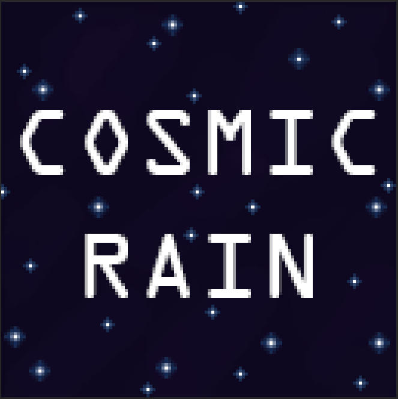
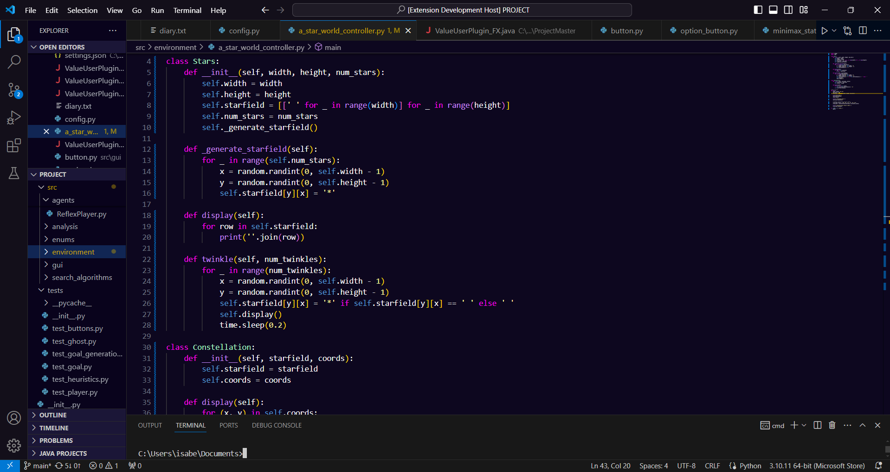

# Cosmic Rain

## Overview

Cosmic Rain is a Visual Studio Code theme inspired by the galaxy. It features bold, vibrant colors set against a dark blue background, evoking the vastness and beauty of the cosmos.

This theme has been tested on Python code.

## Features

- **Bold Colors:** The theme uses a rich palette of bold colors for syntax highlighting, making your code stand out.
- **Dark Blue Background:** A soothing, dark blue background inspired by the night sky, providing a comfortable coding experience.

## Installation

1. Open Visual Studio Code.
2. Go to the Extensions view by clicking on the Extensions icon in the Activity Bar on the side of the window or by pressing `Ctrl+Shift+X`.
3. Search for "Cosmic Rain".
4. Click on the install button.

## Screenshots

### Code Example

---

I hope you enjoy using the Cosmic Rain theme! If you like it, please give it a rating on the Visual Studio Code Marketplace.

**Author:** Isabel Young
**Version:** 1.0.0
